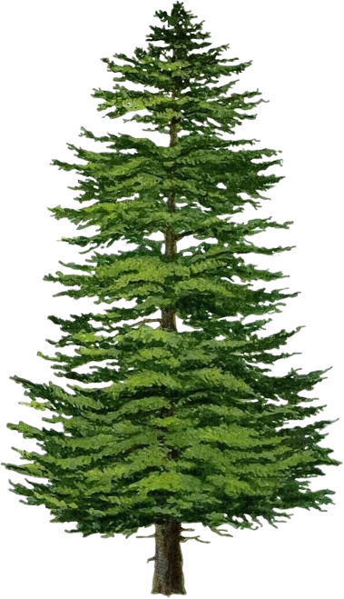
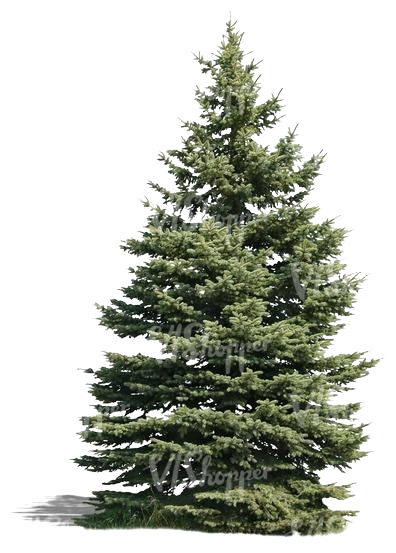

# ForestMind — Forest Cover Intelligence Classification (an ML Project)




Machine learning classification of seven forest cover types using cartographic and environmental data from four Colorado wilderness areas.

**[UCI Dataset](https://archive.ics.uci.edu/dataset/31/covertype)** · **[AI Engineer](https://github.com/raniafahimx)**

---

## Table of Contents

- [Project Overview](#project-overview)
- [Dataset](#dataset)
- [Forest Cover Types](#forest-cover-types)
- [Models](#models)
- [Results](#results)
- [Feature Importance](#feature-importance)
- [Per-Class Metrics](#per-class-metrics)
- [Web Application](#web-application)
- [Project Structure](#project-structure)
- [Tech Stack](#tech-stack)
- [Key Findings](#key-findings)
- [Limitations and Future Work](#limitations-and-future-work)
- [Citation](#citation)

---

## Project Overview

ForestMind is a full-stack machine learning project that classifies forest cover types across Roosevelt National Forest, Colorado. Two ensemble classifiers were trained and evaluated on the UCI Covertype Dataset to predict which of seven ecologically distinct forest cover types occupies any given 30x30 meter terrain cell.

The project includes a fully interactive web application with model performance visualizations, a confusion matrix explorer, feature importance analysis, and a live predictor tool where users can input cartographic measurements to classify a terrain cell in real time.

**Task:** Multi-class classification across 7 forest cover types using 54 cartographic features.

---

## Dataset

| Property | Value |
|----------|-------|
| Name | UCI Covertype Dataset |
| Source | [UCI Machine Learning Repository](https://archive.ics.uci.edu/dataset/31/covertype) |
| Total Observations | 581,012 |
| Features | 54 |
| Classes | 7 |
| Location | Roosevelt National Forest, Colorado, USA |
| Cell Size | 30 x 30 meters |
| Wilderness Areas | 4 (Rawah, Neota, Comanche Peak, Cache la Poudre) |

### Feature Breakdown

| Type | Count | Description |
|------|-------|-------------|
| Quantitative cartographic | 10 | Elevation, aspect, slope, distances to hydrology/roadways/fire points, hillshade indices |
| Wilderness area binary flags | 4 | One-hot encoded wilderness designation |
| Soil type binary flags | 40 | USFS ELU (Ecological Land Unit) classifications |
| **Total** | **54** | |

---

## Forest Cover Types

| Type | Name | Samples | % of Dataset |
|------|------|---------|--------------|
| 1 | Spruce / Fir | 211,840 | 36.5% |
| 2 | Lodgepole Pine | 283,301 | 48.8% |
| 3 | Ponderosa Pine | 35,754 | 6.2% |
| 4 | Cottonwood / Willow | 2,747 | 0.5% |
| 5 | Aspen | 9,493 | 1.6% |
| 6 | Douglas-fir | 17,367 | 3.0% |
| 7 | Krummholz | 20,510 | 3.5% |

**Class imbalance note:** Lodgepole Pine dominates at 48.8% while Cottonwood/Willow represents only 0.5% of observations. This significantly impacts per-class recall for minority species, particularly Aspen (1.6%) and Cottonwood/Willow (0.5%).

---

## Models

### Data Split

| Set | Samples | Method |
|-----|---------|--------|
| Training | 50,000 | Stratified random sample |
| Test | 116,203 | Held-out evaluation set |

Stratified sampling ensures proportional class representation in both sets despite significant class imbalance.

### Random Forest

```
Algorithm:     RandomForestClassifier (sklearn)
n_estimators:  100
max_depth:     20
random_state:  42
criterion:     gini
```

An ensemble of 100 independently trained decision trees, each voting on the final class. Feature randomness at each split reduces variance and prevents overfitting on the 54-feature space.

### Gradient Boosting

```
Algorithm:     HistGradientBoostingClassifier (sklearn)
n_estimators:  100
max_depth:     5
subsample:     0.8
learning_rate: 0.1
```

A sequential ensemble where each tree corrects the residual errors of its predecessor using gradient descent in function space. HistGradientBoosting uses the same histogram-based binning algorithm as XGBoost and LightGBM, making it functionally equivalent while natively available in scikit-learn.

> **Note:** XGBoost was the originally intended comparison model. HistGradientBoostingClassifier was used as a direct algorithmic equivalent due to environment constraints at training time.

---

## Results

| Metric | Random Forest | Gradient Boosting |
|--------|:-------------:|:-----------------:|
| Test Accuracy | **85.0%** | 82.8% |
| Test Samples | 116,203 | 116,203 |
| Correctly Classified | 98,773 | 96,216 |

Random Forest achieves best overall accuracy at 85.0%, correctly classifying 98,773 of 116,203 held-out test observations across seven cover types.

---

## Feature Importance

Top 15 features by Random Forest impurity-based importance:

| Rank | Feature | Importance |
|------|---------|-----------|
| 1 | Elevation | 26.2% |
| 2 | Dist. to Roadways | 9.1% |
| 3 | Dist. to Fire Points | 8.2% |
| 4 | Dist. to Hydrology (H) | 5.2% |
| 5 | Dist. to Hydrology (V) | 4.9% |
| 6 | Aspect | 4.6% |
| 7 | Hillshade Noon | 4.5% |
| 8 | Wilderness Area 4 | 4.3% |
| 9 | Hillshade 9am | 4.1% |
| 10 | Hillshade 3pm | 4.1% |
| 11 | Slope | 3.5% |
| 12 | Soil Type 22 | 2.3% |
| 13 | Soil Type 39 | 1.7% |
| 14 | Soil Type 10 | 1.6% |
| 15 | Wilderness Area 3 | 1.5% |

Elevation alone accounts for 26.2% of predictive power. Distance features form the secondary signal layer, reflecting anthropogenic and hydrological influences on species distribution.

---

## Per-Class Metrics

Random Forest per-class performance on the held-out test set:

| Cover Type | Precision | Recall | F1 Score |
|------------|:---------:|:------:|:--------:|
| Spruce/Fir | 87% | 81% | 84% |
| Lodgepole Pine | 83% | 92% | 87% |
| Ponderosa Pine | 84% | 88% | 86% |
| Cottonwood/Willow | 88% | 71% | 79% |
| Aspen | 93% | 24% | 39% |
| Douglas-fir | 85% | 62% | 72% |
| Krummholz | 95% | 78% | 86% |

Aspen has the lowest F1 score (39%) due to severe class imbalance — the model achieves 93% precision but only 24% recall, rarely predicting Aspen even when it is the true class. Lodgepole Pine achieves the highest F1 (87%) as the majority class with the most training examples.

---

## Web Application

Built as a single-file static HTML/CSS/JS application

**Sections:**
- Hero with animated stat counters
- Seven species cards with tree imagery and distribution bars
- Side-by-side RF vs. Gradient Boosting model comparison
- Class distribution bar chart and F1 radar chart
- Top 15 feature importance bars
- Interactive 7x7 confusion matrix (toggle Normalized % / Raw Counts)
- Per-class precision, recall and F1 table (toggle RF / GB)
- Live forest cover predictor with confidence scores for all 7 classes
- Dataset impact statistics and tech stack credits

**Design:** Montserrat + Poppins typography, forest green palette, scroll-reveal animations, Chart.js visualizations.

> The live predictor uses a rule-based classifier derived from Random Forest feature importance thresholds. Full sklearn model inference is not available in-browser as Python cannot run natively in static HTML.

---

## Project Structure

```
forest-cover-classification/
│
├── forest_cover_classifier.html
├── spruce.png
├── pine.png
├── ponderosa.png
├── willow.png
├── aspen.png
├── douglas.png
├── krummholz.png
├── covtype.info
└── README.md
```

All 7 PNG files must be in the same directory as `forest_cover_classifier.html` for tree images to render correctly.

---

## Tech Stack

| Tool | Purpose |
|------|---------|
| Python 3 | Data loading, preprocessing, model training |
| Pandas | Dataset ingestion and manipulation |
| NumPy | Numerical operations |
| scikit-learn | RandomForestClassifier, HistGradientBoostingClassifier, metrics |
| Chart.js | Interactive charts in browser |
| HTML / CSS / JS | Web application frontend |
| GitHub Pages | Static site hosting |

---

## Key Findings

**Elevation dominates.** At 26.2% feature importance, elevation is more predictive than the next five features combined. Each species occupies a distinct altitudinal band shaped by temperature, precipitation, and soil formation.

**Class imbalance is the core challenge.** Aspen (1.6% of data) achieves 93% precision but only 24% recall. The model rarely predicts Aspen because defaulting to Lodgepole Pine is statistically safer given the training distribution.

**Spruce/Fir and Lodgepole Pine confusion is ecologically real.** The 19% misclassification rate between these two species reflects genuine habitat overlap in the Rawah and Comanche Peak wilderness areas, not purely model error.

**Random Forest outperforms Gradient Boosting by 2.2%.** The parallel ensemble structure of Random Forest appears better suited to the high-dimensional binary feature space (40 soil type flags) than the sequential correction mechanism of gradient boosting.

---

## Limitations and Future Work

**Current limitations:**
- No oversampling or class weighting applied — Aspen and Cottonwood/Willow recall would benefit from SMOTE or `class_weight='balanced'`
- Models trained on 50,000 of 581,012 samples for computational efficiency
- No hyperparameter tuning via GridSearchCV or RandomizedSearchCV
- In-browser predictor uses rule-based logic, not the actual trained sklearn model

**Planned improvements:**
- Apply SMOTE oversampling to minority classes
- Implement RandomizedSearchCV for hyperparameter optimization
- Train on the full 581,012 sample dataset
- Export trained model to ONNX format for true in-browser inference
- Add XGBoost as a third comparison model

---

## Citation

Blackard, J. & Dean, D. (1999). *Covertype* [Dataset]. UCI Machine Learning Repository. https://doi.org/10.24432/C50K5N

Data collected from the US Forest Service (USFS) Region 2 Resource Information System and the US Geological Survey (USGS).

---

*Roosevelt National Forest, Colorado — 581,012 observations · 54 features · 7 cover types · 4 wilderness areas*
